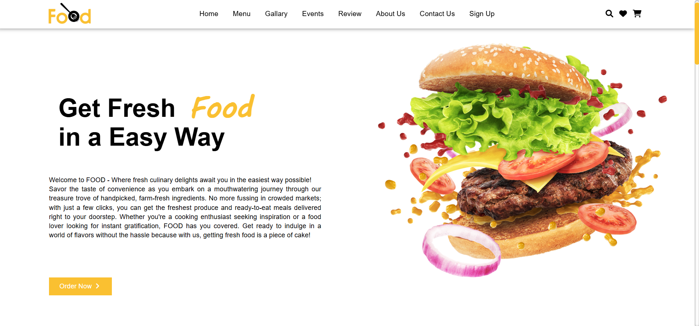

# 🍽️ Flavor Fiesta - Culinary Website 🍕


## 📖 Overview

**Flavor Fiesta** is a responsive, user-friendly food website designed to showcase a variety of culinary delights and provide an exceptional online food ordering experience. The website features an elegant design with interactive elements, making it easy for users to browse through various food options, place orders, and stay updated on upcoming food events.



## 🌟 Features

### 🏠 Homepage

- Welcoming hero section with captivating imagery
- About Us section highlighting unique selling points
- Customer review carousel showcasing testimonials
- Quick order navigation buttons

### 🍔 Menu Section

- Comprehensive display of food categories
- Detailed item descriptions with high-quality images
- Pricing information and star ratings
- Quick "Order Now" buttons for seamless purchasing

### 📸 Gallery

- Visual showcase of delectable food items
- Aesthetic presentation of culinary creations
- Multiple images displaying ambiance and food quality

### 🎉 Events

- Upcoming culinary events with dates and locations
- Special menu nights and promotional offers
- Event booking functionality
- Detailed event descriptions and pricing

### 📝 Contact Form

- User-friendly contact interface
- Form for inquiries, feedback, and special requests
- Essential contact fields (name, email, phone, message)

### 👤 User Authentication

- Sign-up page for new users
- Account management capabilities
- Personalized user experience

## 🛠️ Technologies Used

- HTML5
- CSS3
- Responsive Design
- Font Awesome Icons
- Google Fonts

## 📱 Responsive Design

Flavor Fiesta is fully responsive and optimized for various devices including:

- Desktop computers
- Laptops
- Tablets
- Mobile phones

## 🚀 Getting Started

### Prerequisites

- Modern web browser (Chrome, Firefox, Safari, or Edge)
- Internet connection

### Installation

1. Clone the repository

   ```bash
   git clone https://github.com/deaeneth/flavor-fiesta.git
   ```

1. Navigate to the project directory

   ```bash
   cd flavor-fiesta
   ```

1. Open `index.html` in your preferred browser

## 📂 Project Structure

```plaintext
flavor-fiesta/
├── index.html          # Home page
├── menu.html           # Food menu page
├── gallery.html        # Photo gallery
├── events.html         # Events listings
├── contactus.html      # Contact form
├── readmore.html       # Extended about us
├── signup.html         # User registration
├── style.css           # Main stylesheet
├── README.md           # Project documentation
└── image/              # Image assets directory
    └── ...             # Various images
```

## 🎨 Color Scheme

- Primary: #ff702a (Vibrant Orange)
- Secondary: #fac031 (Golden Yellow)
- Background: #ffffff (White)
- Text: #333333 (Dark Gray)
- Accents: #b50202 (Deep Red)

## 🌐 Live Demo

Visit the live website: [Flavor Fiesta](https://deaneeth.github.io/flavor-fiesta)

## 📊 Future Enhancements

- 🛒 Integrated shopping cart functionality
- 💳 Secure payment gateway
- 🔄 Real-time order tracking
- 🌙 Dark mode toggle
- 📱 Mobile application development

## 👨‍💻 Contributors

- Your Name - [GitHub Profile](https://github.com/deaneeth)

## 📄 License

This project is licensed under the MIT License - see the LICENSE file for details.

## 🙏 Acknowledgments

- Font Awesome for the beautiful icons
- Google Fonts for the typography
- Unsplash for stock images (if applicable)

---

⭐ Star this repo if you like what you see! ⭐
